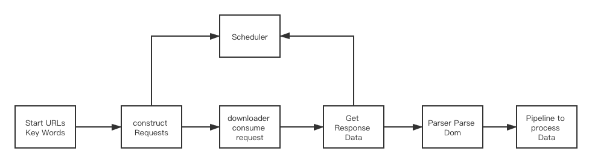
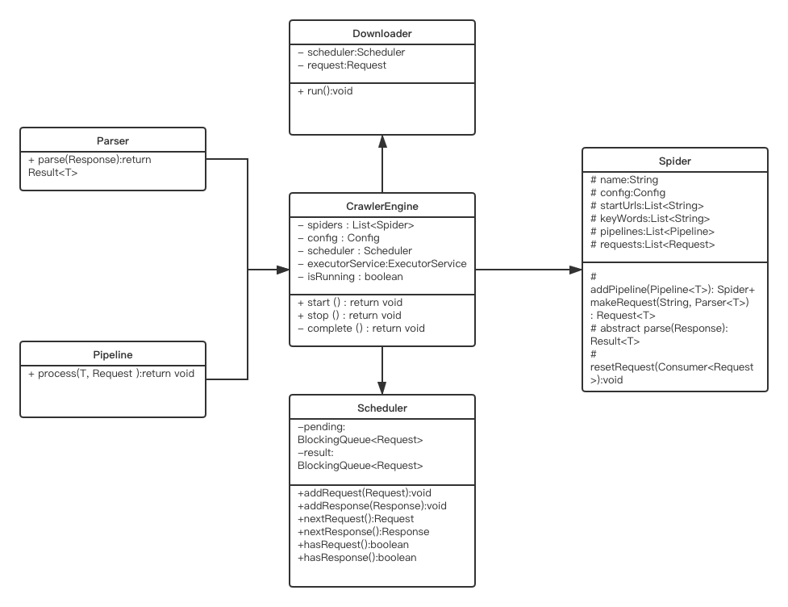

# crawler
Web crawler is thought to be the foundation of search engine technology. It is very convient to crawle some data from internet to do data analytics. 

## Idea
Usually for web crawler we need to do following steps:
1. get the urls you want to crawle
2. connect to website and download the html
3. parse the html
4. get the data you need

So in this crawler, just encapsulate these processes
1. URL Manager (Crawler)
2. Scheduler: schedule requests
3. Downloader: download the html
4. Parser: parse the html
5. Pipeline: process the data


## Develop Environment
- JDK8
- Maven 3.3.9


## Code Structure

source tree
```
├── Crawler.java
├── CrawlerEngine.java
├── config
├── download
├── event
├── pipeline
├── request
├── response
├── scheduler
├── spider
└── utils
```


Flow Chart



Class Diagram




## Limitations & Future Work
Currently the parser and pipeline need the user to customize for their own requirements. In BBCNewsExample, this demo downloads all
the news title form the given urls and only print the titles with keywords.


## Usages
You can start to try by running 
- `mvn clean package` to generate the jar.
- `mvn -e exec:java -Dexec.classpathScope="test"` to check the test result


